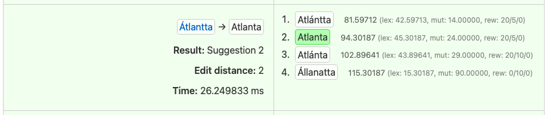

# divvunspell

[](https://builds.giellalt.org/pipelines/divvunspell)
[](https://crates.io/crates/divvunspell)
[](https://docs.rs/divvunspell)

A fast, feature-rich spell checking library and toolset for HFST-based spell checkers. Written in Rust, divvunspell is a modern reimplementation and extension of [hfst-ospell](https://github.com/hfst/hfst-ospell) with additional features like parallel processing, comprehensive tokenization, case handling, and morphological analysis.

## Features

- **High Performance**: Memory-mapped transducers and parallel suggestion generation
- **ZHFST/BHFST Support**: Load standard HFST spell checker archives
- **Smart Tokenization**: Unicode-aware word boundary detection with customizable alphabets
- **Case Handling**: Intelligent case preservation and suggestion recasing
- **Morphological Analysis**: Extract and filter suggestions based on morphological tags
- **Cross-Platform**: Works on macOS, Linux, Windows, iOS and Android

## Quick Start

### As a Command-Line Tool

Download [the latest release](releases/latest), or build from source:

```sh
# Install the CLI
cargo install divvunspell-cli

# Check spelling and get suggestions
divvunspell suggest --archive speller.zhfst --json "sámi"
```

### As a Rust Library

Add to your `Cargo.toml`:

```toml
[dependencies]
divvunspell = "1.0.0-beta.12"
```

Basic usage:

```rust
use divvunspell::archive::{SpellerArchive, ZipSpellerArchive};
use divvunspell::speller::{Speller, SpellerConfig, OutputMode};

// Load a spell checker archive
let archive = ZipSpellerArchive::open("language.zhfst")?;
let speller = archive.speller();

// Check if a word is correct
if !speller.clone().is_correct("wordd") {
    // Get spelling suggestions
    let config = SpellerConfig::default();
    let suggestions = speller.clone().suggest("wordd");

    for suggestion in suggestions {
        println!("{} (weight: {})", suggestion.value, suggestion.weight);
    }
}

// Morphological analysis
let analyses = speller.analyze_input("running");
for analysis in analyses {
    println!("{}", analysis.value); // e.g., "run+V+PresPartc"
}
```

## Command-Line Tools

### divvunspell

The main spell checking tool with support for suggestions, analysis, and tokenization.

```sh
# Get suggestions for a word
divvunspell suggest --archive language.zhfst "wordd"

# Always show suggestions even for correct words
divvunspell suggest --archive language.zhfst --always-suggest "word"

# Limit number and weight of suggestions
divvunspell suggest --archive language.zhfst --nbest 5 --weight 20.0 "wordd"

# JSON output
divvunspell suggest --archive language.zhfst --json "wordd"

# Tokenize text
divvunspell tokenize --archive language.zhfst "This is some text."

# Get suggestions with morphological analysis
divvunspell suggest --archive language.zhfst -A "wordd"
```

**Options:**
- `-a, --archive <FILE>` - BHFST or ZHFST archive to use
- `-A, --analyze` - Enable analyze mode: show suggestions with their morphological analyses
- `-S, --always-suggest` - Show suggestions even if word is correct
- `-w, --weight <WEIGHT>` - Maximum weight limit for suggestions
- `-n, --nbest <N>` - Maximum number of suggestions to return
- `--no-reweighting` - Disable suggestion reweighting (closer to hfst-ospell behavior)
- `--no-recase` - Disable case-aware suggestion handling
- `--json` - Output results as JSON
- `-v, --verbose` - Show detailed weight information (lexicon, mutator, reweighting)

**Analyze mode output format:**

**Note:** Analyze mode (`-A`) requires that the spell checker's acceptor (lexicon) is a full morphological analyzer, such as those used with grammar checkers. Standard spell checkers without morphological analysis will not produce meaningful output with this flag.

When using `-A` (analyze mode), the output shows each suggestion with its morphological analyses:

```
Input: wordd		[INCORRECT]
word	word N Sg Nom	10.5	25.3 (lex: 10.5, mut: 15.0, rew: 0/5/0)
word	word V Inf	12.0	27.0 (lex: 12.0, mut: 15.0, rew: 0/5/0)

words	word N Pl Nom	8.2	45.8 (lex: 8.2, mut: 30.0, rew: 0/5/10)
```

The format is tab-separated: `suggestion\tanalysis\tanalysis_weight\tsuggestion_weight (details)`

- **suggestion**: The corrected word form
- **analysis**: Morphological analysis with tags (e.g., `word N Sg Nom` = noun, singular, nominative)
- **analysis_weight**: Weight from the lexicon for this specific analysis
- **suggestion_weight**: Total weight for this specific analysis (analysis_weight + mutator + reweighting)
- **details** (with `--verbose`): Breakdown of weights for this analysis:
  - **lex**: Lexicon weight (same as analysis_weight)
  - **mut**: Mutator (error model) weight (same for all analyses of this suggestion)
  - **rew**: Positional reweighting (start/middle/end, same for all analyses of this suggestion)

Each analysis is calculated as: `total = lexicon_weight + mutator_weight + reweighting`

If a suggestion has multiple analyses, each appears on a separate line with its own weights. A blank line separates the analyses for each unique suggestion to improve readability.

**Debugging:**

Set `RUST_LOG=trace` to enable detailed logging:

```sh
RUST_LOG=trace divvunspell suggest --archive language.zhfst "wordd"
```

### thfst-tools

Convert HFST and ZHFST files to optimized THFST and BHFST formats.

**THFST** (Tromsø-Helsinki FST): A byte-aligned HFST format optimized for fast loading and memory mapping, required for ARM processors.

**BHFST** (Box HFST): THFST files packaged in a [box](https://github.com/bbqsrc/box) container with JSON metadata for efficient processing.

```sh
# Convert HFST to THFST
thfst-tools hfst-to-thfst acceptor.hfst acceptor.thfst

# Convert ZHFST to BHFST (recommended for distribution)
thfst-tools zhfst-to-bhfst language.zhfst language.bhfst

# Convert THFST pair to BHFST
thfst-tools thfsts-to-bhfst --errmodel errmodel.thfst --lexicon lexicon.thfst output.bhfst

# View BHFST metadata
thfst-tools bhfst-info language.bhfst
```

### accuracy (feature-gated subcommand)

Test spell checker accuracy against known typo/correction pairs. This subcommand is available when `divvunspell` is built with the `accuracy` feature.

```sh
# Build with accuracy support
cargo install divvunspell-cli --features accuracy

# Run accuracy test
divvunspell accuracy typos.tsv language.zhfst

# Save detailed JSON report
divvunspell accuracy -o report.json typos.tsv language.zhfst

# Limit test size and save TSV summary
divvunspell accuracy -w 1000 -t results.tsv typos.tsv language.zhfst

# Use custom config
divvunspell accuracy -c config.json typos.tsv language.zhfst
```

**Configuration format** (`config.json`): Fine-tune the spell checker algorithm with a JSON configuration file. All fields are optional and will use defaults if omitted:

```json
{
  "n-best": 10,
  "max-weight": 10000,
  "beam": 50,
  "reweight": {
    "start-penalty": 10.0,
    "end-penalty": 10.0,
    "mid-penalty": 5.0
  },
  "node-pool-size": 128,
  "recase": true,
  "completion-marker": null
}
```

**Configuration options:**

- **`n-best`** (default: `10`): Maximum number of suggestions to return
- **`max-weight`** (default: `10000.0`): Maximum weight for any suggestion. Suggestions with higher weight are discarded
- **`beam`** (default: `null`): Weight distance between best and worst suggestion. Set to `null` to disable beam search
- **`reweight`**: Additional penalties for different edit distance error types
  - **`start-penalty`** (default: `10.0`): Penalty for errors at the start of the word
  - **`end-penalty`** (default: `10.0`): Penalty for errors at the end of the word
  - **`mid-penalty`** (default: `5.0`): Penalty for errors in the middle of the word
- **`node-pool-size`** (default: `128`): Size of node pool for parallelization
- **`recase`** (default: `true`): Whether to try fixing capitalization before other suggestions
- **`completion-marker`** (default: `null`): Marker used when suggesting incomplete word parts. Set to `null` to disable

**Input format** (`typos.tsv`): Tab-separated values with typo in first column, expected correction in second:

```
wordd    word
recieve  receive
teh      the
```

**Accuracy viewer** (prototype web UI):

```sh
divvunspell accuracy -o support/accuracy-viewer/public/report.json typos.txt language.zhfst
cd support/accuracy-viewer
npm i && npm run dev
# Open http://localhost:5000
```

If you are using a config file, use this variant of the first command above:

```sh
divvunspell accuracy -c config.json -o support/accuracy-viewer/public/report.json typos.txt language.zhfst
```

The configuration used is always printed at the top of the web report, with default values printed if no configuration file is specified.

#### `accuracy` with detailed weight information

By adding `--verbose` to the command above, every suggestion will have all weight details listed, to help debug suggestion issues.
The `accuracy` command will be something like this:

```sh
divvunspell accuracy --verbose -c config.json -o support/accuracy-viewer/public/report.json typos.txt language.zhfst
```

The result in the web report looks like this:



The total weight for a suggestion is printed after each suggestion, as usual. In addition, a parenthesis is added with the following weight details:

- **lex:** lexicon weight, includes both frequency weight and tag weights as specified in `tools/spellcheckers/weights/tags.reweight`
- **mut:** mutator weight, ie the weight added by the error model
- **rew:** position-based reweighting, separated by `/`:
	- first position
	- middle positions (all but first and last)
	- last position

The reweight weights are specified in the configuration, default weights (see above) will be used if not specified. At least one reweight will always be added, based on where the mutation from input to suggestion is done.

## Building from Source

### Install Rust

```sh
curl https://sh.rustup.rs -sSf | sh
source $HOME/.cargo/env
rustup default stable
```

### Build Everything

```sh
# Build all crates
cargo build --release

# Install specific tools
cargo install --path ./cli                       # divvunspell CLI
cargo install --path ./cli --features accuracy   # divvunspell CLI with accuracy subcommand
cargo install --path ./crates/thfst-tools
```

### Run Tests

```sh
cargo test
```

## Documentation

- **API Documentation**: [docs.rs/divvunspell](https://docs.rs/divvunspell)
- **GitHub Pages**: [divvun.github.io/divvunspell](https://divvun.github.io/divvunspell/)

## License

The **divvunspell library** is dual-licensed under:

- Apache License, Version 2.0 ([LICENSE-APACHE](LICENSE-APACHE) or http://www.apache.org/licenses/LICENSE-2.0)
- MIT license ([LICENSE-MIT](LICENSE-MIT) or http://opensource.org/licenses/MIT)

You may choose either license for library use.

The **command-line tools** (`divvunspell`, `thfst-tools`) are licensed under **GPL-3.0** ([LICENSE-GPL](LICENSE-GPL)).
